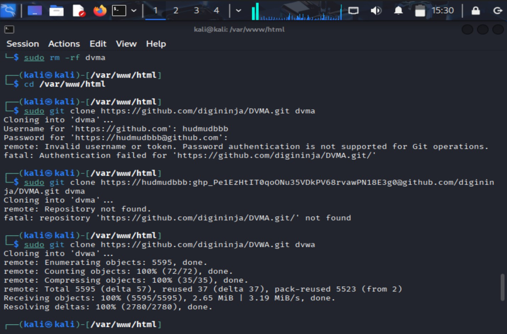

# Ильин Владимир 241-372

# Задание 1

# Клонирование репозитория
$ sudo git clone https://github.com/digininja/DVWA.git dvwa

# Настройка прав доступа

# Изменение владельца на пользователя веб-сервера
$ sudo chown -R www-data: www-data /var/www/html/dvwa

# Установка базовых прав доступа
$ sudo chmod -R 755 /var/www/html/dvwa

# Особые разрешения для загрузок и конфигурации
$ sudo chmod -R 777 /var/www/html/dvwa/hackable/uploads/
$ sudo chmod -R 777 /var/www/html/dvwa/config/

В моем случае, они почему-то не могут быть найдены.

# Задание 2
# Анализ работы с Burp Suite для тестирования безопасности

## Обзор сценария

Процесс тестирования на проникновение с использованием **Burp Suite** для атаки на форму логина DVWA.

## Компоненты Burp Suite

### 1. Интерфейс прокси (Proxy)
- **Intercept включен** - перехватывает HTTP-запросы от браузера
- **Запрос к**: `http://127.0.0.1/dvwa/login.php`
- **Метод**: POST с данными формы логина
- **Cookies**: 
  - `security=impossible`
  - `PHPSESSID=a5d244f1fc42c8d466e9adabd868b916`

### 2. Настройка Intruder атаки

#### Payload Set 1 (Полезная нагрузка 1)
- **Тип**: Simple list
- **Количество payloads**: 6
- **Содержание**: usernames для брутфорса
  - admin
  - mama
  - dad
  - moon
  - space
  - hacker

#### Payload Set 2 (Полезная нагрузка 2)
- **Тип**: Simple list
- **Количество payloads**: 8
- **Содержание**: passwords для брутфорса
  - password
  - logic
  - reasoning
  - shuttle
  - help
  - book
  - worm
  - fire

### 3. Результаты Intruder атаки

**Общее количество запросов**: 48 (6 пользователей × 8 паролей)

#### Примеры отправленных комбинаций:
- `admin:password` - Status: 200, Length: 5105
- `mama:logic` - Status: 200, Length: 5063
- `dad:reasoning` - Status: 200, Length: 5063
- `admin:reasoning` - Status: 200, Length: 5063

## Анализ результатов

### Наблюдения:
1. **Разная длина ответа**: Запрос `admin:password` имеет длину 5105, в то время как другие комбинации - 5063
2. **Все статусы 200**: HTTP 200 OK для всех запросов
3. **Отсутствие блокировок**: Нет признаков защиты от брутфорс-атак

### Возможные уязвимости:
- Отсутствие ограничения попыток входа
- Нет капчи или двухфакторной аутентификации
- Предсказуемые ответы сервера

# Задание 3

## Цель лаборатории

Демонстрация уязвимости перечисления имен пользователей через различные ответы сервера при неудачных попытках аутентификации.

## Процесс атаки

### Этап 1: Перехват и анализ запросов

**Инструмент**: Burp Suite Proxy
- **Intercept выключен** - для наблюдения за трафиком
- **Целевой домен**: `web-security-academy.net` (разные поддомены для этапов)

### Этап 2: Перечисление имен пользователей (Username Enumeration)

#### Первая Intruder атака
- **Цель**: Найти действительные имена пользователей
- **Метод**: Анализ различных ответов сервера

**Результаты перечисления пользователей**:
ads - действительный пользователь

**Ключевое наблюдение**:
- Пользователь `ads` имеет **длину ответа 3520**, в то время как другие - 3248

### Этап 3: Подбор пароля

#### Вторая Intruder атака
- **Известный пользователь**: `ads`
- **Цель**: Найти правильный пароль

**Результаты подбора пароля**:
matrix - успешный

**Ключевое наблюдение**:
- Успешная аутентификация возвращает **статус 302** (редирект) и меньшую длину ответа

# Задание 4 

- Проведено декодирование в **Burp Suite Decoder**  
