# Выполненность заданий

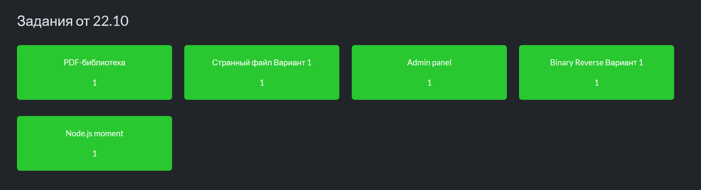

# Задание 1
# PDF-библиотека
Заходим на сайт по IP и запускаем Burp pro
Сначала расшифровываем запросы и понимаем, что кодировка  ASCII hex

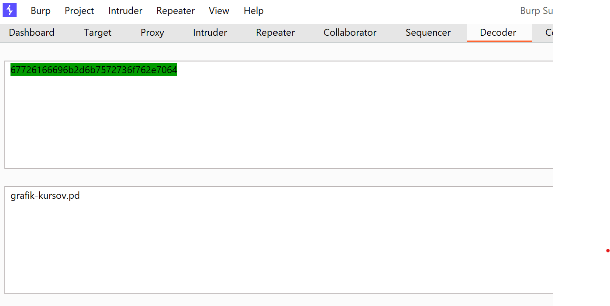

Выполняем запрос GET к каждому PDF файлу

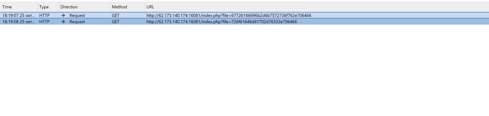

Кодируем etc/passwd и /var/www/html/index.php запросы и задаем их в repeater

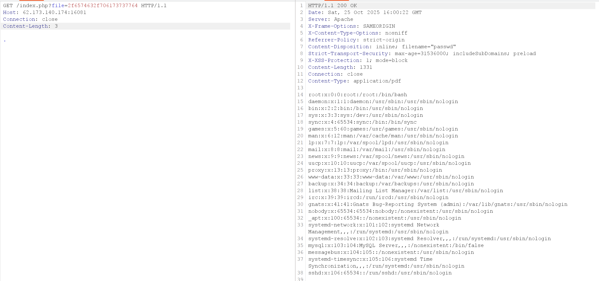
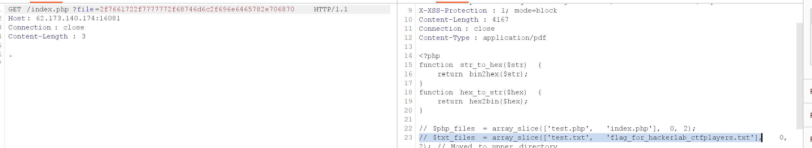

В Запросе /var/www/html/index.php получаем нформацию о файле flag_for_hackerlab
Кодируем этот запрос также и задаем запрос GET к этому файлу

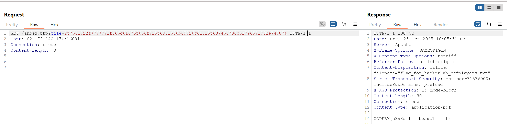

В нем находим флаг


# Задание 2
# Странный файл Вариант 1 
Используем онлайн декодеры hex и определяем тип файла по первым строчкам кода

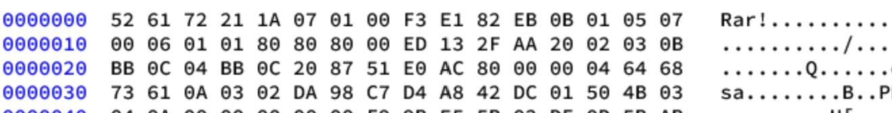

Смотрим коды hex на Wiki и их форматы

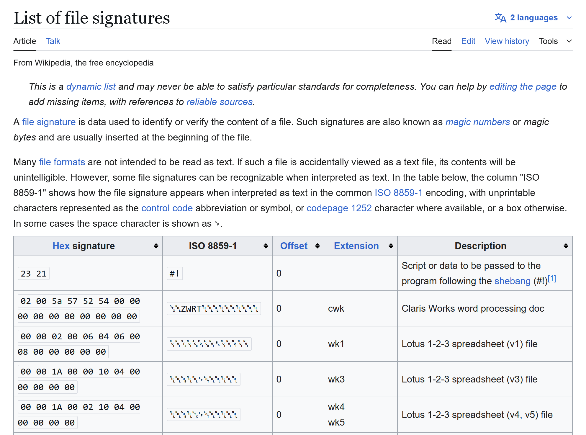

Определяем тип двух файлов и находм внуртри файл .pyc и декодируем его в .py
Внутри находим закодированный флаг
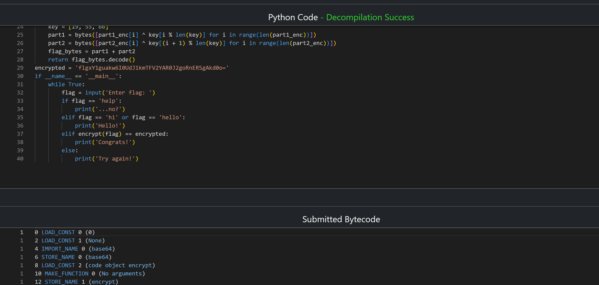

Немного меняем код, так как метод расшифрования уже написан, применяем его и получаем флаг
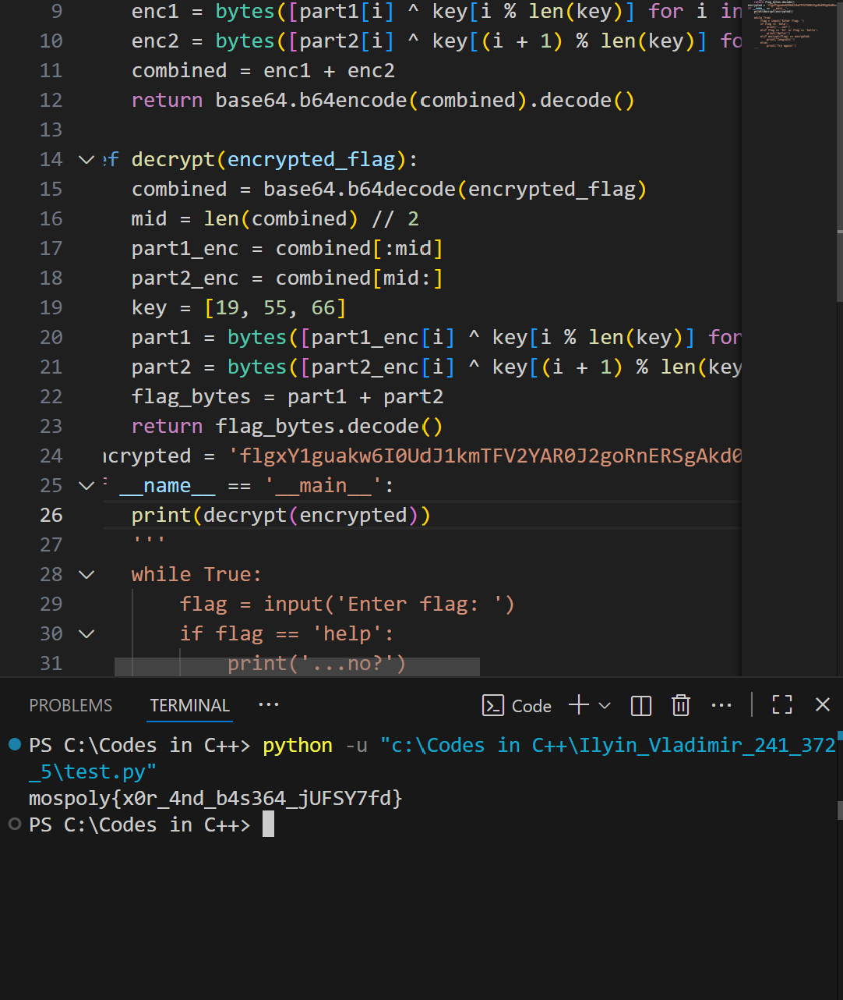


# Задание 3
# Admin panel 
Захоидм на сайт, создаем аккаунт, после переходим в раздел admin panel и получаем ключ-фальшивку
Проверяем запрос GET и определяем, что используется token: JWT - JSON WebTokens.
JWT состоит из 3-х частей разделенных точкой
1. Заголовок JWT
2. Полезная нагрузка JWT
3. Подпись JWT
   
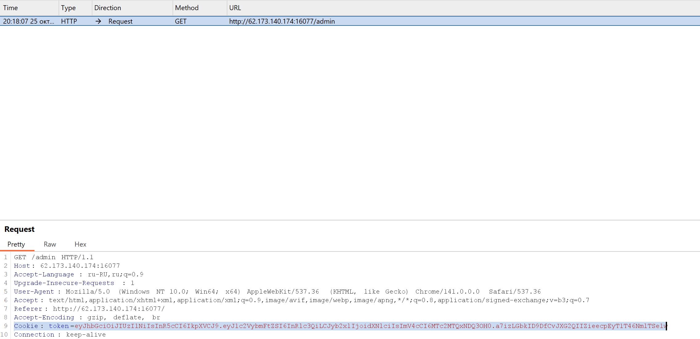

Проверяем, что содержит Полезная нагрузка JWT, декодируем ее

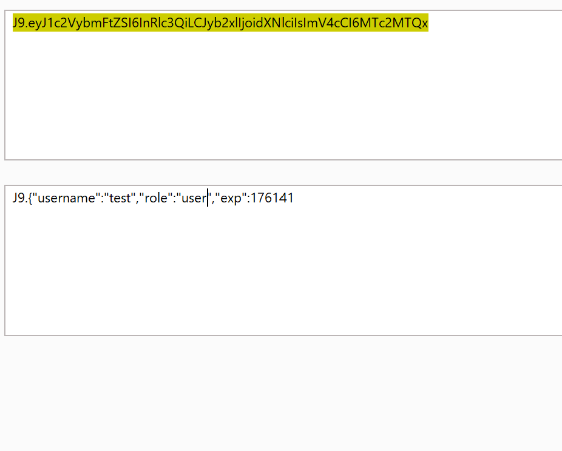

Заменяем role c user на admin и кодируем

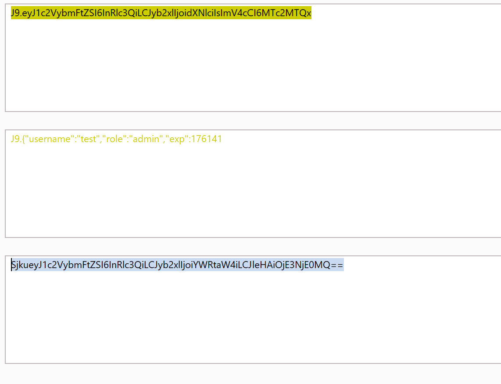

Дальше делаем запрос на admin panel (GET /admin), получаем Подпись JWT и составляем полноценный JWT token, после чего делаем запрос в repeater и получаем частично зашифрованный флаг


Декодируем его из HTML

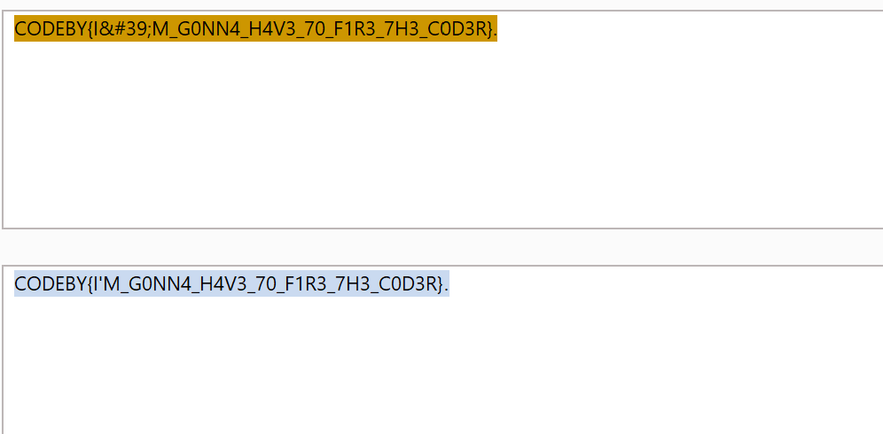


# Задание 4
# Binary Reverse Вариант 1 
1. file 1
   Показывает, что 1 — это 64-битный ELF-исполняемый файл, динамически скомпонованный, не stripped (есть символы отладки).

2. ls -l 1
   Права -TW-TW-TW- — это странно, вероятно, опечатка в скриншоте, но обычно -rwxrwxrwx (все права). Размер 16264 байта.

3. strings 1 | head -n 40
   Выводит строки из бинарного файла. Видны имена функций (fgets, strcmp, printf), что намекает на программу, читающую ввод и сравнивающую строки (возможно, проверка флага).

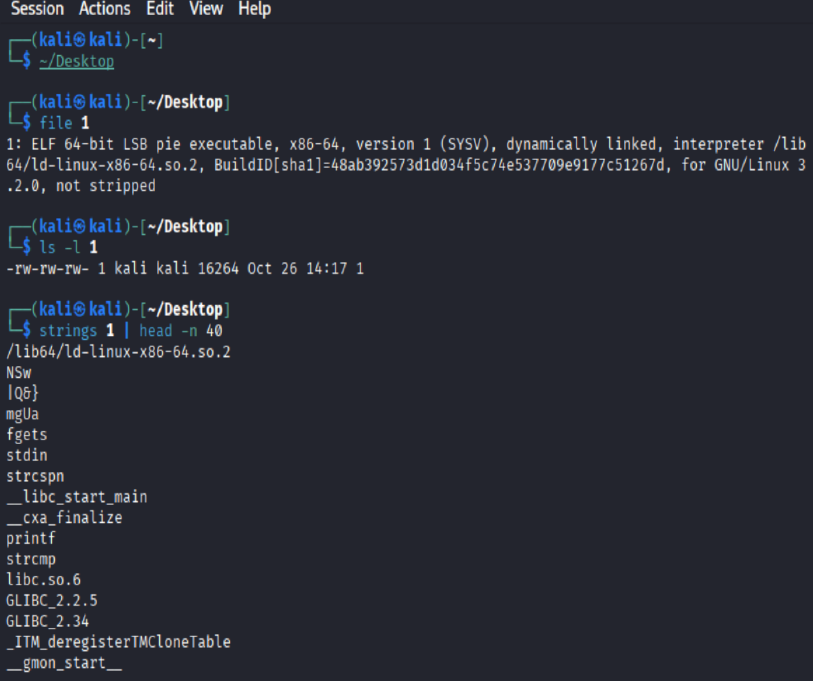

readelf -S 1
Показывает таблицу секций. Видны стандартные секции:

.interp — интерпретатор динамической линковки

.dynsym, .dynstr — символы динамической линковки

.rela.dyn, .rela.plt — таблицы релокации

.text, .rodata (не показаны здесь, но обычно есть) — код и read-only данные.

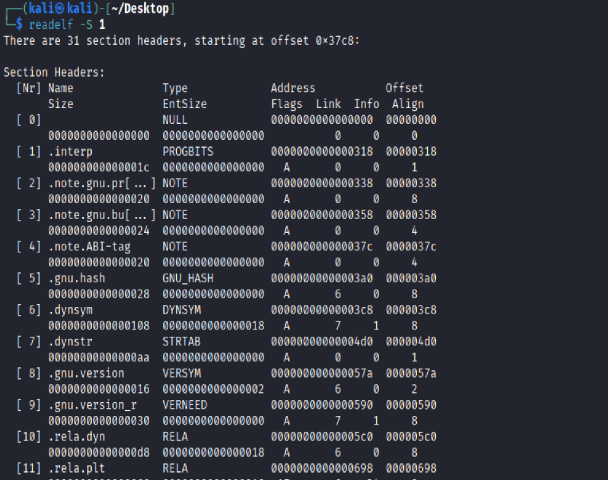

objdump -d 1 | grep -n "0x" | head -n 50
Показывает дизассемблированный код

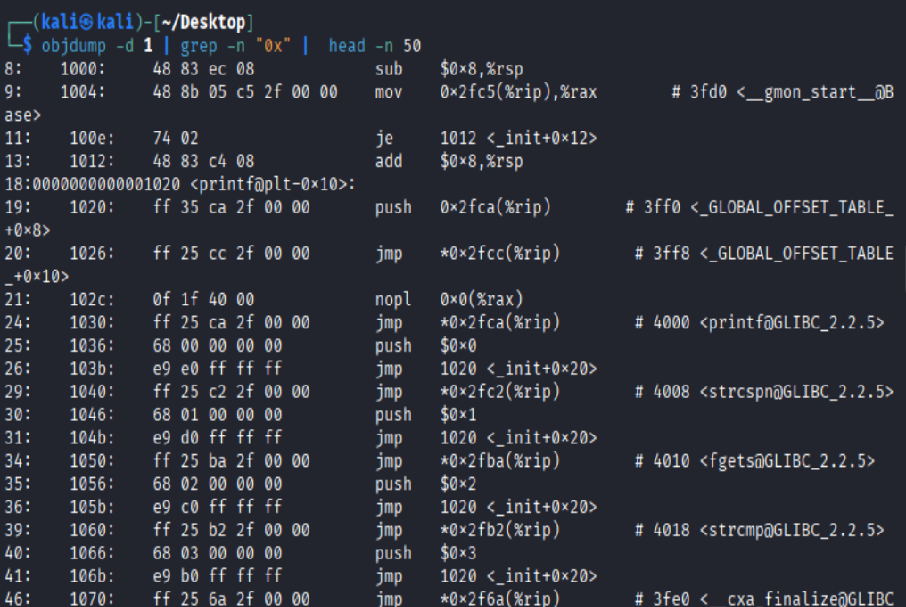

nm -C 1 | grep get_key -n
Находит символ get_key в таблице символов по адресу 0x1220

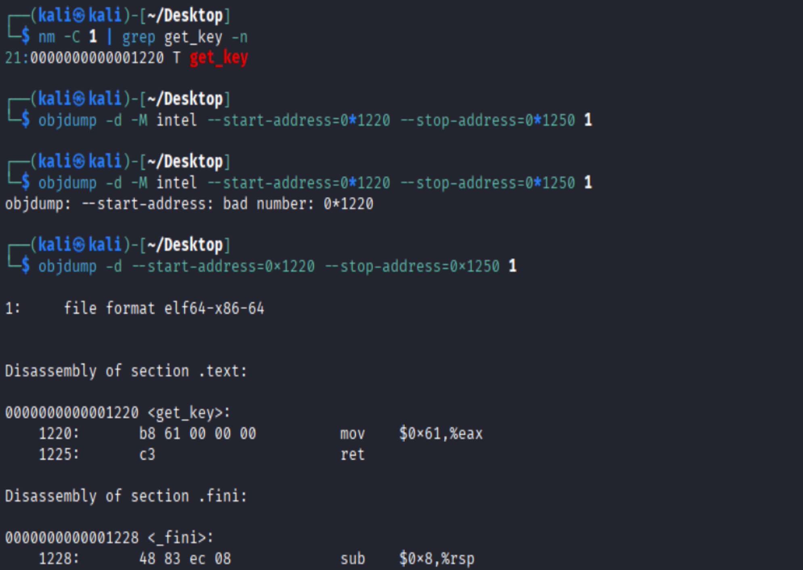

Поиск в .rodata
Пытаются извлечь шестнадцатеричные данные из секции .rodata файла 1 и сохранить в enc.hex.

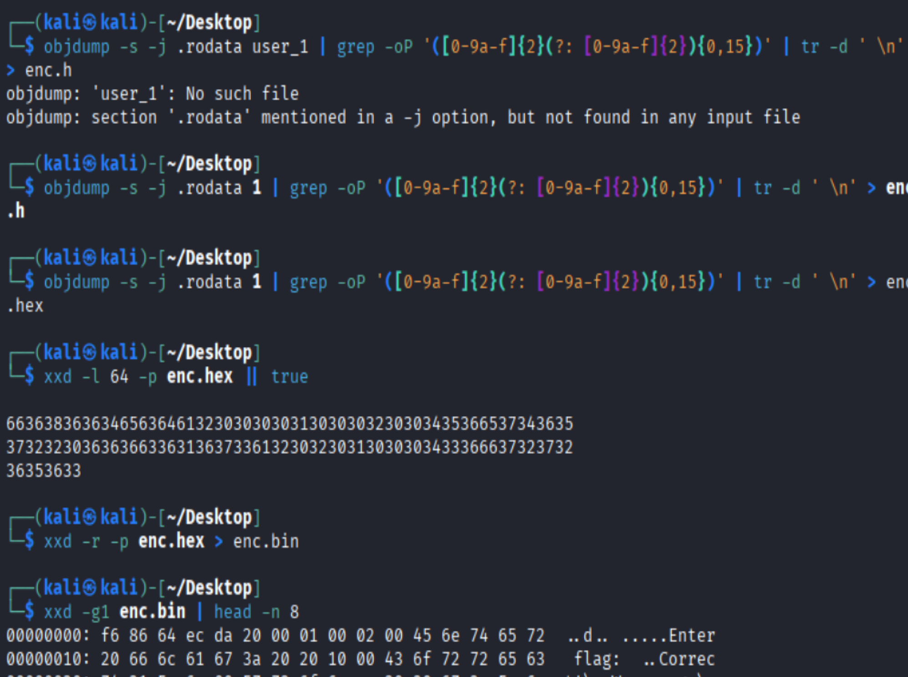

Создаем код на Python и переносим его на главный экран

```
import re

# читаем файл
with open('enc.bin', 'rb') as f:
    d = f.read()

for k in range(1, 256):
    dec = bytes([byte ^ k for byte in d])

    # быстрый фильтр — если встречается последовательность байт 'FLAG{'
    if b'FLAG{' in dec:
        # пробуем декодировать в utf-8, иначе latin1
        try:
            s = dec.decode('utf-8', errors='ignore')
        except Exception:
            s = dec.decode('latin1', errors='ignore')

        m = re.search(r'FLAG\{.*?\}', s)
        if m:
            print(f"FOUND KEY=0x{k:02X}  FLAG={m.group(0)}")
        else:
            # на случай, если флага нет, но строка выглядит читаемо
            print(f"FOUND KEY=0x{k:02X}  (no FLAG match) -- sample:\n{s[:200]}")
        break
else:
    print("FLAG не найден: перебор ключей завершён.")

```

После чего используем его через командную строку

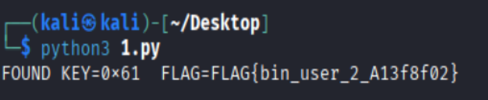

Получаем ключ.


# Задание 5
# Node.js moment 

1. Запускаем Burp pro и захоидм на сайт, вводим логин  и пароль любой, перехватываем данные

2. Копируем запрос GET/ api/flag в repeater

3. Вводим строчку (уязвимость middleware, используем множественный запрос)

```
X-Middleware-Subrequest:middleware:middleware:middleware:middleware:middle
```

4. Получаем доступ и ключ:

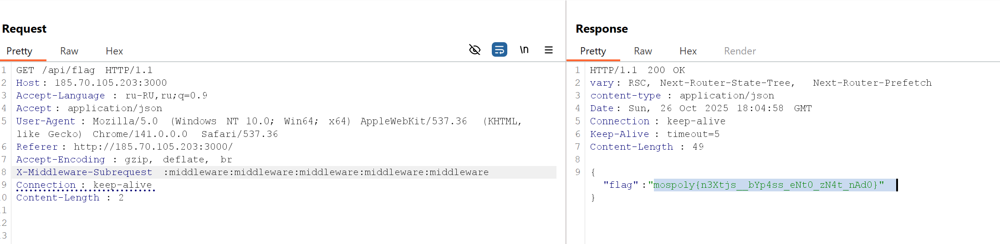


