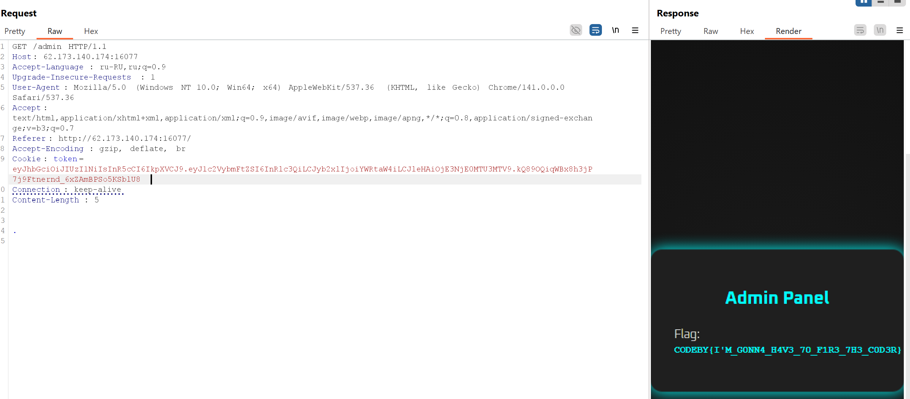

# Задание 1
# PDF-библиотека
Заходим на сайт по IP и запускаем Burp pro
Сначала расшифровываем запросы и понимаем, что кодировка  ASCII hex

Выполняем запрос GET к каждому PDF файлу

Кодируем etc/passwd и /var/www/html/index.php запросы и задаем их в repeater

В Запросе /var/www/html/index.php получаем нформацию о файле flag_for_hackerlab
Кодируем этот запрос также и задаем запрос GET к этому файлу

В нем находим флаг

# Задание 2
# Странный файл Вариант 1 
Используем онлайн декодеры hex и определяем тип файла по первым строчкам кода

Смотрим коды hex на Wiki и их форматы

Определяем тип двух файлов и находм внуртри файл .pyc и декодируем его в .py
Внутри находим закодированный флаг

Немного меняем код, так как метод расшифрования уже написан, применяем его и получаем флаг

# Задание 3
# Admin panel 
Захоидм на сайт, создаем аккаунт, после переходим в раздел admin panel и получаем ключ-фальшивку
Проверяем запрос GET и определяем, что используется token: JWT - JSON WebTokens.
JWT состоит из 3-х частей разделенных точкой
1. Заголовок JWT
2. Полезная нагрузка JWT
3. Подпись JWT
   

Проверяем, что содержит Полезная нагрузка JWT, декодируем ее

Заменяем role c user на admin и кодируем

Дальше делаем запрос на admin panel (GET /admin), получаем Подпись JWT и составляем полноценный JWT token, после чего делаем запрос в repeater и получаем частично зашифрованный флаг

Декодируем его из HTML

